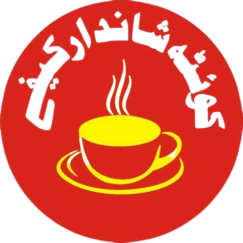

# Sample Quetta Hotel - Responsive HTML5 Website




This repository contains the HTML and CSS source code for the Live Dinner Restaurant website template. This template is responsive and suitable for restaurant websites.


## Table of Contents

- [Introduction](#introduction)
- [Features](#features)
- [Installation](#installation)
- [Usage](#usage)
- [License](#license)

## Introduction

This Website is designed for restaurants and similar businesses. It provides a responsive and visually appealing layout for showcasing your restaurant's menu, about page, reservation form, and more.

## Features

- Responsive design for various screen sizes.
- Navigation menu with dropdown options.
- Reservation form for booking tables.
- Customer reviews section.
- Contact information and location details.
- Ordering foor
- Bill Generation
- Booking Services

## Installation

1. Clone this repository to your local machine.
     ```bash
            https://github.com/shahzaibjanjua25/Sample-Website-for-Quetta-Hotel/

## Usage

You can use this template as a starting point for your restaurant's website. Customize the content, images, and styles to match your branding and menu.


## License

This template is provided under the [MIT License](LICENSE).

---

**Note:** This template uses Bootstrap for styling and functionality. Make sure to review the licensing terms for Bootstrap if you plan to use it in a production environment.

